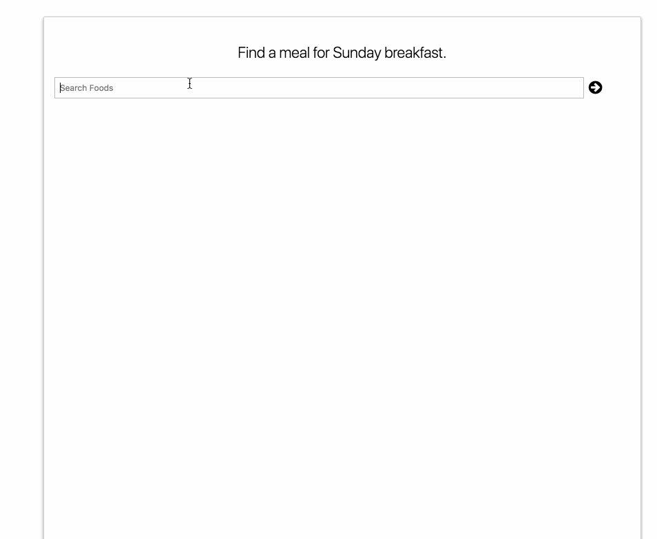

## Udaci-meals

This project is an app and will feature a customizable calendar for users to track their breakfast, lunch, and dinner through the week. Users will leverage Edamam's Recipe Search API to add meals, then generate a shopping list of ingredients based on the meals chosen.

# Required Software

* [Git](https://git-scm.com/)
* [npm](http://npmjs.com/)

# Getting Set Up

* clone this repo
* `cd` into the newly cloned project
* install npm dependencies via `npm install`

# View the app

* Run `npm start` and :boom:
